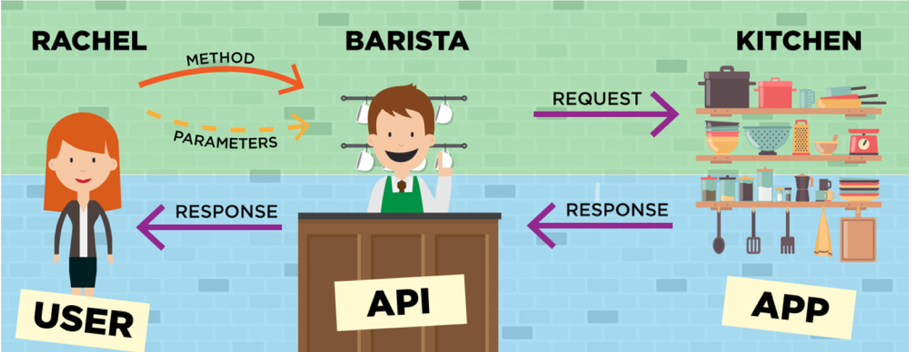
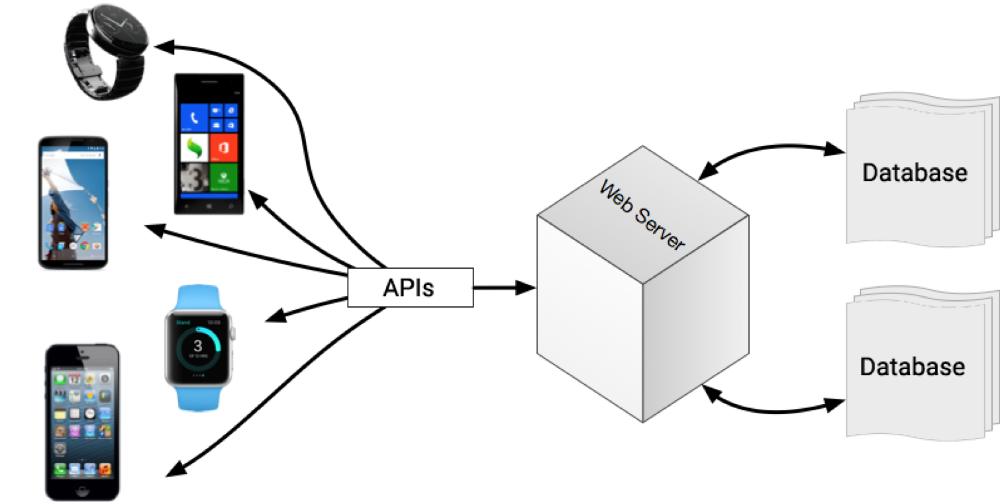

Imagine you regularly work with a large, frequently updated online dataset. How do you access the latest data each time you need it? What if you work with only a small segment of the data?

In such a case, accessing up-to-date information wpuld traditionally mean downloading the entire dataset each time—a process that is far from efficient.

Additinally, let's say your task involves mapping longitude and latitude values from the dataset on to a global map, which is a different size each time. Manually scaling these values to accurately place them on a map not only invites redundancy but is also prone to error. Performing these calculations repeatedly for common, globally recognized locations is an unnecessary drain on resources and time.

This is where APIs come into play. APIs are designed to eliminate such redundancies and boost efficiency. They allow you to request and receive only the data you need, even if it's just a small portion of a larger dataset. For tasks like mapping, APIs can also facilitate automatic handling of the complex calculations and data rendering, presenting you with ready-to-use results.

## What is an API
An Application Programming Interface (API) defines how different software components should interact, allowing them to communicate and share data and functionalities efficiently.

## How APIs work

## How APIs work

## Python Libraries as APIs
You might already be familiar with the concept of APIs from using Python. For instance, instead of writing out the formula to calculate a mean, you can simply use math.mean(). This approach saves time and simplifies your code. APIs abstract away complexity, allowing you to focus on higher-level problem-solving.

## Web APIs
Although library APIs in Python, such as the math library, differ from web APIs, the principle remains the same. 

 library APIs (such as those in Python's standard library) are collections of pre-written code that you can call within your program to perform specific tasks without needing to implement the functionality from scratch.

 In contrast, Web APIs are interfaces for interacting with web services over the internet.