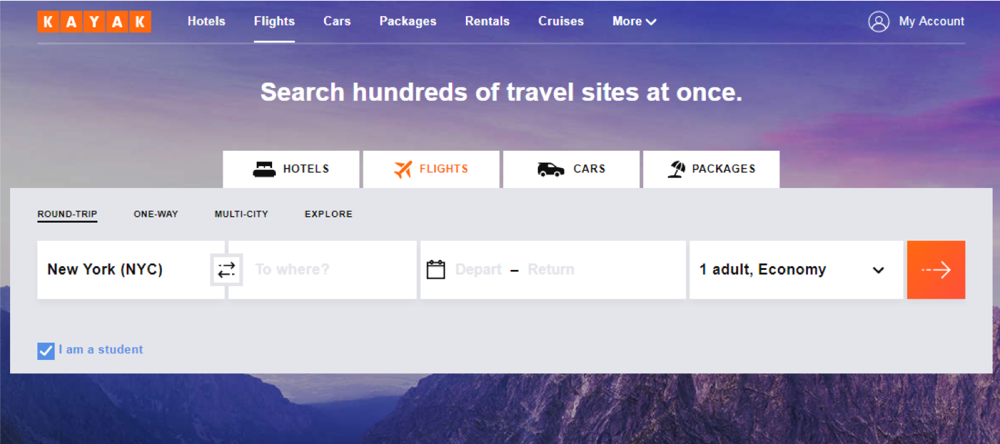

## Vocabulary

- **API** – Application Programming Interface
    - A set of clearly defined methods of communication between various software
       components. (https://en.wikipedia.org/wiki/Application_programming_interface)
- **REST** – REepresentational State Transfer
    - _A data-driven architecture for web services reliant on HTTP_
       - **GET** – Requests data to be returned from an online source
       - **POST** – Requests data to be submitted to an online source
- **OAuth** – Open Authorization Standard

## What is an API?

- Web Applications 
    - Kayak or Expedia

## Library-related APIs

- HathiTrust
    - Bibliographic API: [https://www.hathitrust.org/bib_api](https://www.hathitrust.org/bib_api)
    - Data API: [ttps://www.hathitrust.org/data_api](https://www.hathitrust.org/data_api)
- Springer or BioMedCentral
    - 4 APIs: [Sttps://dev.springer.com/](https://dev.springer.com/)
- OCLC
    - 22 APIs: [https://www.oclc.org/developer/develop/web-services.en.html](https://www.oclc.org/developer/develop/web-services.en.html)
    - Includes ‘Search’, ‘Metadata’, and ‘VIAF’ APIs
- Voyager API
    - 2 APIs (VoyagerSearch, VoyagerUpdate)
    - Developed by YUL Library IT (Yue Ji)
    - Actively used by Preservation Department for their project and workflow

## How APIs work

## How APIs work

