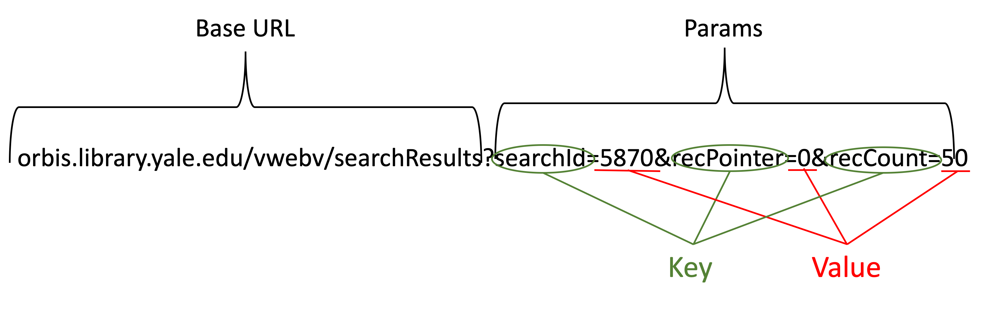

## URL Query Strings

### YouTube

 **[https://www.youtube.com/watch?v=s7wmiS2mSXY&t=1m45s](https://www.youtube.com/watch?v=s7wmiS2mSXY&t=1m45s)**

### Orbis

**[https://orbis.library.yale.edu/vwebv/searchResults?searchArg=python&searchCode=GKEY&searchType=0&recCount=10](https://orbis.library.yale.edu/vwebv/search?searchArg=python&searchCode=GKEY%5E*&searchType=0&recCount=10)**

## Reading Documentation

- Look through the params
    - What types of search parameters are available?
    - Do they match what you need?
    - What is the Endpoint (Base URL)?
- Look for sample requests & responses
    - What kind of data does it return?
    - Is it what you’re looking for?
- Look for restrictions
    - Is it free?
    - Does it require a key or permissions?
    - Do they impose a limit?

## Creating a Query
- National Weather Service API
    - Documentation: [https://forecast-v3.weather.gov/documentation?redirect=legacy](https://forecast-v3.weather.gov/documentation?redirect=legacy)
    - Endpoint/Base URL: https://api.weather.gov

>## Let’s create a query 
> Run this query: https://api.weather.gov/stations?limit=10&state=CT
>1. What do the results show?
>2. What is the Station Identifier for Tweed-New Haven Airport?
>3. Write a query that returns all active weather alerts for California. (Hint: use 'area' not 'state')
>
>>## Solution
>>1. Shows 10 currently-active weather stations in Connecticut and includes metadata about each station.
>>2. KHVN
>>3. https://api.weather.gov/alerts?active=1&area=CA or https://api.weather.gov/alerts/active?area=CA or https://api.weather.gov/alerts/active/area/CA
>{: .solution}
{: .challenge}

