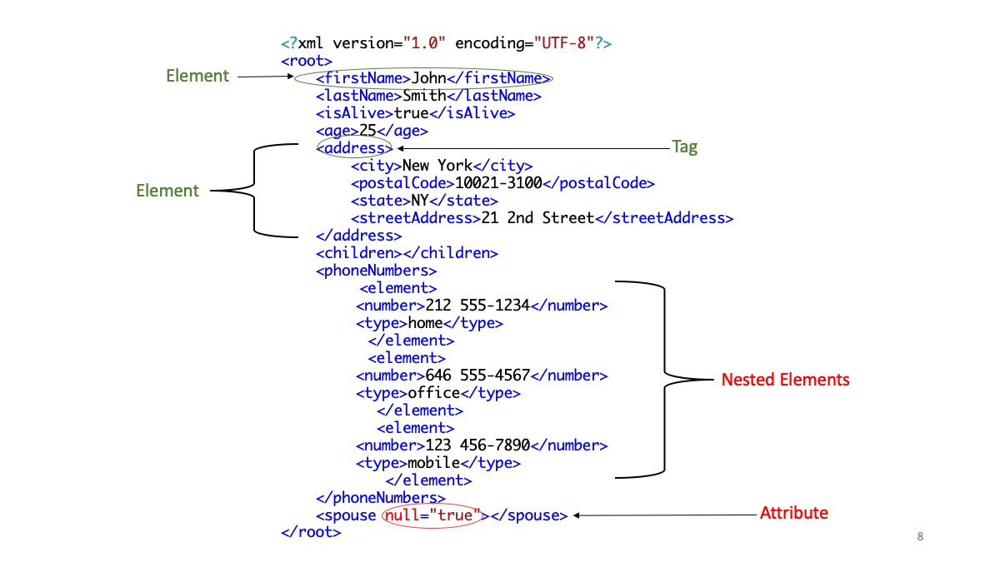

## Response Body

The response body in an HTTP transaction carries the payload, which could be the requested HTML page, a JSON or XML file containing data from an API, an image, a video stream, or any other type of content that a client requests.
The format and structure of the response body depend on the type of resource requested and the server's implementation. For example, a REST API might send data in JSON format, while a web server might respond with HTML or binary data like images and documents.

## Data Formats

- **JSON** – JavaScript Object Notation
  - Plain text, can open on any text editor or web browser
- **XML** – eXtensible Markup Language


## Concepts

- **Params** – Parameters
    - _The variables that specify how your requests are handled_
       - _Search Parameters_
- **Key/Value pairs**
    - _A unique identifier (key) for a category of data and the actual data (value) for that_
       _category_
```
{
 “key1”: “value”,
 “key2”: 170
 “key2”: [ “value1”, “value2” ],
 “key3”: {
    “key3.1”: “value”,
    “key3.2”: “value”
}
          }
```

### JSON
- Many types of data can be stored in JSON

```
{
"firstName" : "John",
"lastName" : "Smith",
"isAlive" : true ,
"age" : 25 ,
"address" : {
"streetAddress" : "21 2nd Street",
"city" : "New York",
"state" : "NY",
"postalCode" : "10021"
},
"phoneNumbers" : [
{
"type" : "home",
"number" : "212 555-1234"
},
{
"type" : "office",
"number" : "646 555-4567"
},
{
"type" : "mobile",
"number" : "123 456-7890"
}
],
"children" : [],
"spouse" : null
}
```

Here's the same data with the Key/Value pairs labeled:


### XML
- Like JSON, many different types of data can be stored in XML

Again, here is the same data as above, but in XML format.




## Appropriate Use of Data Accessed through APIs

##### Provide feedback to the original data provider 
Let the original publisher know when you are reusing their data. When you begin using a dataset in a new project, make a note of the publisher’s contact information, the URI of the dataset you used, and the date on which you contacted them. This can be done in the comments within your code where the dataset is used. [This is a W3C recommended best practice](https://www.w3.org/TR/dwbp/#accessAPIs).

##### Follow Licensing Terms
Find and follow the licensing requirements from the original publisher of the dataset. [This is a W3C recommended best practice](https://www.w3.org/TR/dwbp/#accessAPIs).

DataWorld provides a [list of the common license types for datasets](https://help.data.world/hc/en-us/articles/115006114287-Common-license-types-for-datasets). Specific licensing details can usually be found in API documentation. 

##### User Authentication 
Some APIs require you to register for a key, or code, in order to use the tool. This key gives the API developers better ability to track who is accessing and reusing data, and how and how much is being reused, and what the data is being reused for.

##### Be Mindful of Call Limits and Timeouts
An API may limit the number of calls you can make per second, the total number of results you can request from an API, or the window of time in which you can make API calls. If you exceed the limit, you could automatically be blocked from using the API further. 