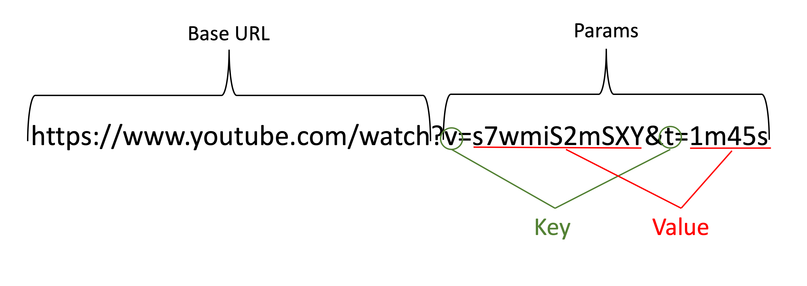

To construct an API query or request, you typically use a combination of endpoints, resources, parameters, and headers. Here's how each component plays a role:

### Endpoints
An endpoint is a specific URL at which an API can be accessed. It represents a specific function or resource within the API. To construct an API query, you start with the base URL of the API and append the specific endpoint that corresponds to the data or functionality you want to access. For example, in a weather API, there might be an endpoint like `/weather` to get current weather data.

### Resources
Resources are the entities or data objects that the API can provide. They represent the types of information the API can return or accept.
Resources are often part of the endpoint path. For example, in an endpoint like `/users/{userId}`, `users` is the resource, and `{userId}` is a variable part of the path that specifies a particular user.

### Parameters
 Parameters are options you can include in your API query to filter, sort, or manipulate the data returned by the API.
- **Types**: There are different types of parameters:
  - **Query Parameters**: Added to the end of the endpoint URL, usually after a `?`, to filter the results. For example, `/weather?city=London` might return weather data specifically for London.
  - **Path Parameters**: Parts of the endpoint URL itself that specify a specific resource or subset of resources. Using the previous example, `{userId}` in `/users/{userId}` is a path parameter.
  - **Body Parameters**: Sent within the request body, typically with POST or PUT requests, containing data to be processed by the API.

### Headers
Headers provide additional metadata for an HTTP request or response. They can include information about the content type, authentication, and other settings. In constructing an API query, headers might be used to pass authentication tokens (e.g., `Authorization: Bearer <token>`) or specify the format of the data being sent (e.g., `Content-Type: application/json`).

## Authentication and identification

Many web APIs restrict access to registered users or applications. This may be
because they are used to control things that are specific to a particular user
account, because different people have different privilege levels and so
different endpoints available, or simply because the API provider wants to
collect statistics on how the API is being used.

Various ways exist for developers to authenticate to an API, including:

## Different methods of Authentication & Authorisation
* Basic Authentication: Username and Password mechanism.
* API Keys: Tokens to identify and validate the user/application.
* OAuth: A standard protocol for token-based authentication and authorization.

One important fact about HTTP is that it is _stateless_: each request is treated
entirely separately, with no memory from one request to the next. This means
that you must present your authentication credentials with every request you
make to the API.

For the vast majority of APIs, there will exist good developer documentation that provides examples of
how to use the token or other identifier that they provide to connect to their
service, including examples.

## Constructing API Queries

### Reading Documentation

- Look through the params
    - What types of search parameters are available?
    - Do they match what you need?
    - What is the Endpoint (Base URL)?
- Look for sample requests & responses
    - What kind of data does it return?
    - Is it what you’re looking for?
- Look for restrictions
    - Is it free?
    - Does it require a key or permissions?
    - Do they impose a limit?

## URL Query Strings

Let's break down the given URL `https://eutils.ncbi.nlm.nih.gov/entrez/eutils/efetch.fcgi?db=nucleotide&id=5&rettype=fasta` to illustrate various API concepts using this specific example:

### Base URL

- **Base URL**: `https://eutils.ncbi.nlm.nih.gov`
  - This part of the URL specifies the protocol (`https`) and the domain (`eutils.ncbi.nlm.nih.gov`), directing the request to the NCBI's (National Center for Biotechnology Information) E-utilities server, which hosts various services and databases.

### Endpoint

- **Endpoint**: `/entrez/eutils/efetch.fcgi`
  - This part of the URL specifies the particular service or function within the API that you want to access. In this case, `efetch.fcgi` is the endpoint that facilitates fetching or retrieving data.

### Resources

- While the term "resources" in a RESTful API context usually refers to a specific type of data or entity (like `/users` or `/posts`), in this URL, the concept is implied through the combination of the endpoint and the query parameters. The resource being accessed here is nucleotide sequence data from NCBI's databases.

### Parameters

Parameters are included in the query string of the URL, which is the part after the `?`, with each key-value pair separated by `&`.

- **`db=nucleotide`**: This parameter specifies the database that the API should search in. Here, `db` stands for "database," and `nucleotide` indicates that the query is targeted at the nucleotide database.
- **`id=5`**: This parameter specifies the unique identifier of the nucleotide sequence you want to retrieve. The `id` here is set to `5`, which would correspond to a specific sequence record in the database.
- **`rettype=fasta`**: This parameter defines the format of the response. `fasta` is a text-based format for representing nucleotide sequences (and protein sequences), indicating that the API should return the data in FASTA format.

### Constructing the API Query

Combining these components, the full URL `https://eutils.ncbi.nlm.nih.gov/entrez/eutils/efetch.fcgi?db=nucleotide&id=5&rettype=fasta` is constructed to specifically fetch a nucleotide sequence with the ID `5` from the nucleotide database in FASTA format.

### Understanding the Query

By sending a request to this URL, you're asking the NCBI E-utilities service to fetch the data for a nucleotide sequence identified by `id=5` from the `nucleotide` database and return it in FASTA format. This is a common task in bioinformatics, where accessing specific genetic sequences efficiently is crucial for research and analysis.

You can combine endpoints, resources, parameters, and headers to construct effective API queries to retrieve data, submit new information, or perform other operations through the API.

### YouTube

 **[https://www.youtube.com/watch?v=s7wmiS2mSXY&t=1m45s](https://www.youtube.com/watch?v=s7wmiS2mSXY&t=1m45s)**

## NASA API - Example of using an API key
NASA offers an API that exposes much of the data that they make
public. They require an API key to identify you, but don't require any
authentication beyond this.

Let's try working with the NASA API now. To do this, first we need to generate
our API key by providing our details at [the API home page][nasa-api]. Once that
is done, NASA provide the API key instantly, and send a copy to the email
address you provide. 

Let's construct an API query to try, querying the Astronomy Picture of the Day (APOD).
The first step is to read and understand the API documentation. They also provide example queries in which you can see that NASA
expects the API key to be encoded as a query parameter.

~~~
$ curl -i "https://api.nasa.gov/planetary/apod?api_key=DEMO_KEY"
~~~
{: .language-bash}

~~~
HTTP/2 200 
date: Thu, 08 Feb 2024 02:39:35 GMT
content-type: application/json
content-length: 1265
vary: Accept-Encoding
access-control-allow-origin: *
access-control-expose-headers: X-RateLimit-Limit, X-RateLimit-Remaining
age: 1
strict-transport-security: max-age=31536000; includeSubDomains; preload
vary: Accept-Encoding
via: https/1.1 api-umbrella (ApacheTrafficServer [cMsSf ])
x-api-umbrella-request-id: cdgqarbvpj8g36vie310
x-cache: MISS
x-ratelimit-limit: 40
x-ratelimit-remaining: 39
x-vcap-request-id: 029df11c-5e1d-4b6b-6389-b62bf72c9566
x-frame-options: DENY
x-content-type-options: nosniff
x-xss-protection: 1; mode=block

{"copyright":"\nKent E. Biggs\n","date":"2024-02-07","explanation":"Are these two galaxies really attracted to each other? Yes, gravitationally, and the result appears as an enormous iconic heart -- at least for now. Pictured is the pair of galaxies cataloged as NGC 4038 and NGC 4039,known as the Antennae Galaxies.  Because they are only 60 million light years away, close by intergalactic standards, the pair is one of the best studied interacting galaxies on the night sky. Their strong attraction began about a billion years ago when they passed unusually close to each other.  As the two galaxies interact, their stars rarely collide, but new stars are formed when their interstellar gases crash together.  Some new stars have already formed, for example, in the long antennae seen extending out from the sides of the dancing duo. By the time the galaxy merger is complete, likely over a billion years from now, billions of new stars may have formed.   Open Science: Browse 3,300+ codes in the Astrophysics Source Code Library","hdurl":"https://apod.nasa.gov/apod/image/2402/Antennae_Biggs_3840.jpg","media_type":"image","service_version":"v1","title":"The Heart Shaped Antennae Galaxies","url":"https://apod.nasa.gov/apod/image/2402/Antennae_Biggs_960.jpg"}
~~~
{: .output}

We can see that this API gives us JSON output including links to two versions
of the picture of the day, and then metadata about the picture including its
title, description, and copyright. The headers also give us some information
about our API usage&mdash;our rate limit is 40 requests per day, and we have
39 of these remaining.

>## Let’s create a query 
>Run this query: https://api.weather.gov/stations?limit=3
>1. What do the results show?
>2. What is the Station Identifier for Hawks Rise Elementary?
>3. Write a query that returns all active weather alerts for California. (Hint: Check API doc https://www.weather.gov/documentation/services-web-api)
>>
>>## Solution
>>1. Shows 3 currently-active weather stations in New York and includes metadata about each station.
>>2. 0005W
>>3. https://api.weather.gov/alerts/active/area/CA

>{: .solution}
{: .challenge}

[nasa-api]: https://api.nasa.gov