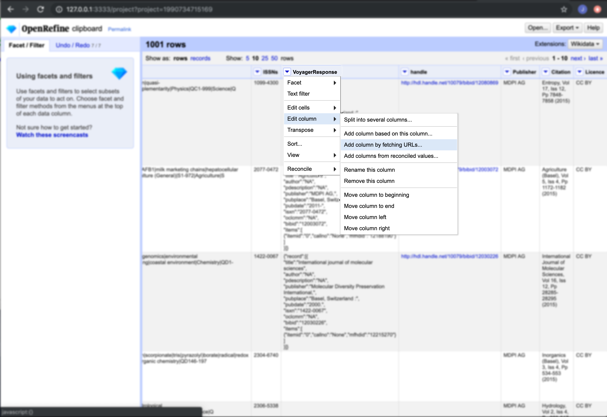
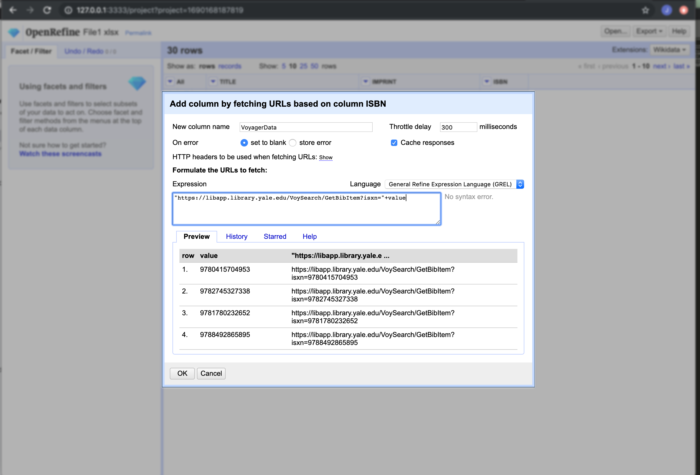
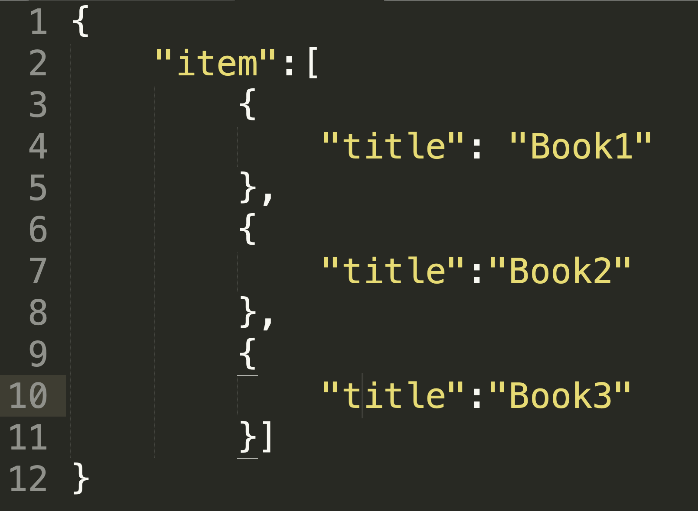

## Fetching data from the web

OpenRefine has built-in functions for accessing data through APIs. We can use the function "Add columns by fetching URLs" to pass :
- 'Edit column' -> 'Add column by fetching URLs..'

We will be using the data in File1.xlsx. The column named 'ISBN' contains ISBN numbers we can use to search the VOyager API. We can request the catalog data about the resource and add that data to our Excel file. 

>## Let's fetch data from Voyager
>
>1. Create a new project in OpenRefine using File1.xlsx 
>2. Select 'ISBN' -> 'Edit column' -> 'Add column by fetching URLs...'
>3. Name new column 'VoyagerData'
>4. Change 'Throttle delay' from 5000 -> 300
>5. Add the expression: '"https://libapp.library.yale.edu/VoySearch/GetBibItem?isxn=" + value'
>6. Click 'OK'
{: .checklist}

## Parse JSON results

Our Voyager API query returns results in JSON format as a single cell in our excel spreadsheet. We can use OpenRefine to parse this JSON to pull out catalog data and insert this data in our spreadsheet.
- OpenRefine has a built-in function called 'parseJson()' that we can use to extract specfic data from the JSON results.
- Because JSON data is often nested, we must navigate to the appropriate 'key' to extract the 'value'.
- We often encounter data organized in an array or list, signified by square brackets: []
	- To access an item in an array, we use the index number starting at zero (0)
	- In the following screenshot, we have an array a books with the key "items"
	- To get the value of 'Book1', we use 'item[0].title' where zero is the index for the first item & "title" is the key for the value we want to extract.
	- To get 'Book2' we would use 'item[1].title', 'Book3' is 'item[2].title', and so on...

>## Let's find the Call Number
>
>Let's pull out the Call Number form our JSON results and add it to a new column called 'CallNo':
>1. Select 'VoyagerData' -> 'Edit column' -> 'Add column based on this column...'
>2. New column name: 'CallNo'
>3. Add the expression: _value.parseJson().record[0].items[0].callno_
>4. Click 'OK'. We should have a new column in out data now. 
{: .checklist}

>## Create a link to the catalog record 
>
>1. What are the steps to create a new column with the location of the first item?
>2. What are the steps to create a new column called 'HandleLink' which is a link to the catalog record for that item? (hint: "http://hdl.handle.net/10079/bibid/" + ?)
>
>>## Solution
>>1. Select 'VoyagerData' -> 'Edit column' -> 'Add column based on this column...'
>>- New column name: 'Location'
>>- Add the expression: 'value.parseJson().record[0].item[0].loccode'
>>- Click 'OK'
>>2. Select 'VoyagerData' -> 'Edit column' -> 'Add column based on this column...'
>>- New column name: 'HandleLink'
>>- Add the expression: '"http://hdl.handle.net/10079/bibid/" + value.parseJson().record[0].bibid'
>>- Click 'OK'	 
>{: .solution}
{: .challenge}

>## Return a JSON array or list
>
>Let's work with an array of data in JSON. We will find the status of each item in the record and save those values in a new column.
>1. Select 'VoyagerData' -> 'Edit column' -> 'Add column based on this column...'
>2. New column name: 'ItemStatus'
>3. Add the expression: 'forEach(value.parseJson().record[0].items,v,v.itemstatus).join(" \| ")'
>4. Click 'OK'. We should have a new column in our data with an array of values.
{: .checklist}

